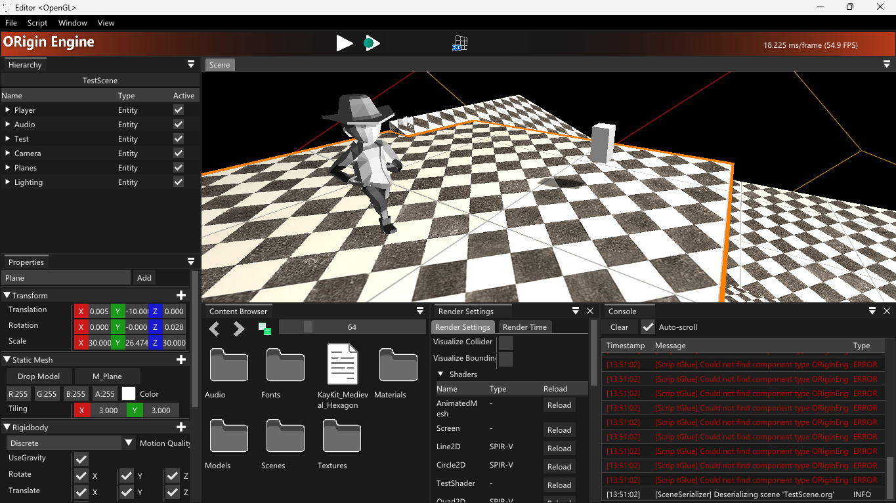
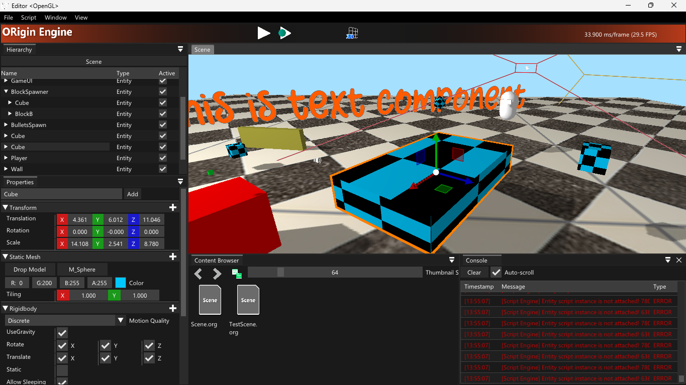
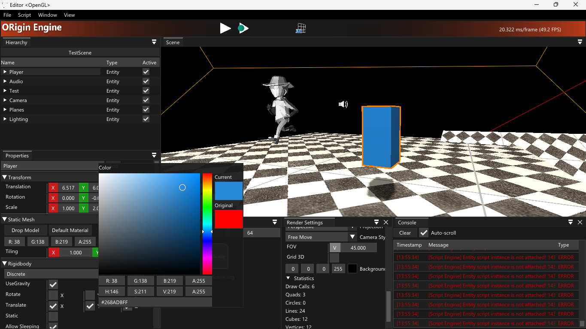

# ORigin Game Engine

#### Clone the repository recursively `git clone --recursive https://github.com/evangelionxyz/ORigin-Engine.git`

## Build on Windows
#### Please Install `pip install requests`
Required [Visual Studio 2022](https://visualstudio.microsoft.com/downloads/) and [Python3](https://www.python.org/downloads/).<br>
Run [gen.bat](gen.bat) to generate Visual Studio .sln file or Makefile.

## Build on Linux tested on Ubuntu-22.04
#### Install 
```bash 
    sudo chown -R $USER: $HOME
    sudo apt install libwayland-dev libxkbcommon-dev xorg-dev zlib1g-dev libfmt-dev zenity gdb libgmock-dev ninja-build
```
#### Install Mono from [Mono Project](https://www.mono-project.com/download/stable/#download-lin) and execute
```bash
    sudo apt install build-essential mono-complete mono-devel mono-dbg libicu-dev
    sudo snap install dotnet-sdk --classic
```
#### Install [Vulkan](https://vulkan.lunarg.com/doc/view/latest/linux/getting_started_ubuntu.html)
```bash
    sudo apt install libvulkan1 mesa-vulkan-drivers vulkan-utils
```
Then run `bash gen.sh` to generate Makefile.

## Preview
<p align="center">
  
  
  
</p>